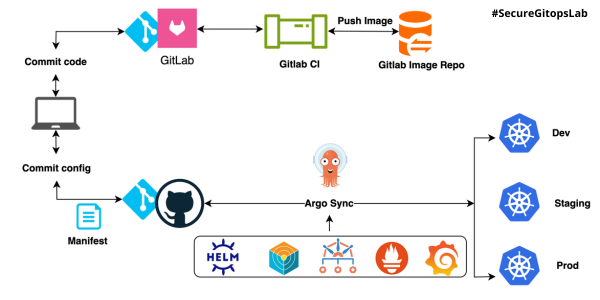

---
# 🔐 SecureGitOpsLab
  
  

🚀 **Projet GitOps sécurisé et observable de bout en bout**  
Dans le cadre de mon parcours **#DevOpsOpenJourney**, SecureGitOpsLab illustre comment automatiser, sécuriser et superviser un cluster Kubernetes et ses applications.

---

## 🎯 Objectifs du projet
- Déployer une **architecture Kubernetes complète** et automatisée  
- Mettre en place **GitOps avec ArgoCD**  
- Sécuriser les déploiements avec **Trivy, Kyverno, Cosign et SBOM**  
- Assurer une **observabilité complète** avec Prometheus, Grafana, Loki et Alertmanager  
- Industrialiser le déploiement applicatif via **Helm & Kustomize**  
- Automatiser les pipelines CI/CD (**GitLab CI / GitHub Actions**)  

---

## 🧩 Stack technique

### Orchestration & Conteneurs
- Docker, Kubernetes (K3d local / EKS cloud)  
- Helm (charts personnalisés pour chaque microservice)  

### Automatisation & Infrastructure as Code
- Terraform, Ansible, Bash  

### CI/CD
- Jenkins, GitLab CI, GitHub Actions  

### Observabilité & Monitoring
- Prometheus, Grafana, Loki, Alertmanager  

### Sécurité DevSecOps
- Trivy (scans de vulnérabilités)  
- Kyverno (politiques Kubernetes)  
- Cosign (signatures d’images)  
- SBOM (Software Bill of Materials)  

---

## 🗂️ Structure du projet

| Dossier         | Contenu |
|----------------|---------|
| `/terraform`   | Déploiement d’infrastructure cloud (EKS) ou local |
| `/argocd`      | Manifests App of Apps & bootstrap GitOps |
| `/kustomize`   | Manifests Kubernetes avec `base` et `overlays` |
| `/helm-charts` | Charts Helm utilisés ou personnalisés |
| `/security`    | Scans Trivy, policies Kyverno, signature Cosign |
| `/observability` | Stack Prometheus / Grafana / Loki |
| `/ci-cd`       | Pipelines GitLab CI ou GitHub Actions |
| `/docs`        | Diagrammes, captures d’écran, README |

---

## 📊 Résultats clés
- Monitoring complet **infrastructure + applicatif**  
- Dashboards Grafana prêts à l’emploi  
- Alertes en temps réel pour anomalies applicatives  
- Déploiements sécurisés et automatisés via GitOps  
- Environnement multi-cluster et multi-environnement industrialisé  

---

## 🚀 Projets liés
- **Taskmanager Helm Chart** : Application Node.js déployée sur K3s via Helm  
- **AWS Terraform-Ansible Lab** : Infrastructure AWS automatisée avec Terraform & Ansible  

---

## 📚 En ce moment
- Préparation du **Certified Kubernetes Administrator (CKA)**  
- Développement de la V2 de **#DevOpsOpenJourney (100% Cloud AWS)**  
- Partage d’expériences DevOps sur LinkedIn  

---

## 🙌 Auteur
**Brahima Bakayoko**  
💬 Contributions, retours et échanges bienvenus !  
📌 Continuité de **#DevOpsOpenJourney**  

📧 ibra.bakayoko82@gmail.com  
🔗 [LinkedIn](https://www.linkedin.com/in/bakayoko-ibrahim)  
🔗 [GitHub](https://github.com/ibrahimbakayoko)  

---

## ⚡ Astuces
- Épingler ce projet sur ton profil GitHub pour le mettre en avant  
- Ajouter des **badges pour chaque technologie** (Terraform, Kubernetes, Prometheus…)  
- Ajouter des **screenshots et diagrammes** pour rendre le README plus visuel
